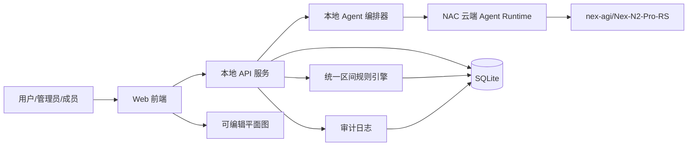
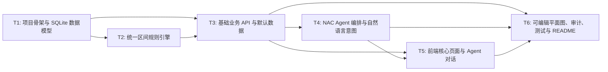

# RFC-0001: Agent 驱动会务系统

## 摘要

本 RFC 设计一个由 Agent 驱动、本地可运行、具备云端 Agent Runtime 的会议室查询与预订 Web 应用。系统围绕实际空间规则建模：活动室午餐时段不可预约、会议室一和会议室二可分别使用也可合并使用、503/505/506 为小会议室且 505 每周二全天不可用。管理员可通过自然语言配置会议室、开放时段和不可预约规则；成员可通过自然语言查询、预订和取消预约；系统必须将配置、预约、禁用规则写入 SQLite 持久化状态，并由统一区间约束模型参与后续冲突校验。

本 RFC 覆盖赛题 Topic A 的全部基础功能与全部挑战功能，并增加面向黑客松评分和真实产品体验的加分项：统一规则引擎、可编辑平面图、管理员强制调整、规则版本/审计、可复现 Demo 数据、NAC 云端 Agent Runtime 环境变量配置，以及面向基础场景的自动化验证脚本。

## 动机

赛题要求作品不是静态页面或关键词 Demo，而是真正由 Agent 参与业务流程：接收自然语言、形成结构化状态或约束、调用业务能力完成配置、推荐、预约、冲突校验和状态变更。当前仓库只有 README 与赛题说明，尚缺少可执行的产品设计、数据模型、接口契约、任务拆分和验证方案。

本 RFC 的目标是把赛题要求转化为可实现的系统边界和协作计划，确保后续实现满足以下关键约束：

1. 必须提供本地可运行的 Web 应用入口。
2. 必须包含实际运行的 Agent 层，LLM API 使用 `nex-agi/Nex-N2-Pro-RS`。
3. 管理员自然语言配置必须进入系统状态，并参与后续冲突校验。
4. 成员自然语言预订必须经过业务规则校验，而不是预先写死答案。
5. 必须支持合并会议室、动态禁用、管理员调整、地图/平面图视图。
6. 必须能通过真实前端操作完成核心业务链路。
7. README 必须提供清晰、可复现的安装和启动步骤，并能基于冻结 Git 版本现场启动。

## 设计

### 概述

系统采用前后端分离的本地 Web 应用架构：

- **前端**：提供会议室列表、日历/时段视图、可编辑平面图、Agent 对话输入、预约管理、规则管理和 Demo 场景入口。
- **本地 API 服务**：暴露会议室、预约、规则、Agent 请求和平面图查询接口；负责参数校验、权限检查、业务事务和 SQLite 持久化。
- **NAC 云端 Agent Runtime**：本地 API 服务将自然语言请求封装为结构化 Agent 调用，使用 `nex-agi/Nex-N2-Pro-RS` 解析意图、抽取参数、生成候选操作；业务服务再对候选操作做确定性校验和执行。
- **SQLite 持久化**：保存会议室、组合关系、开放时间、不可预约规则、预约、规则版本、用户/角色、审计日志和 Demo 初始化数据。
- **统一区间约束模型**：将预约、午餐、固定禁用、临时禁用、合并占用等所有不可预约约束统一表示为区间，查询和预约时统一做重叠校验。

核心数据流：

1. 用户在 Agent 对话或表单中输入自然语言。
2. 本地 API 服务调用 NAC 云端 Agent Runtime，要求返回结构化 JSON，而不是自由文本。
3. 本地业务层解析结构化结果，识别意图类型：查询可用、创建预约、取消预约、配置房间、配置规则、管理员调整等。
4. 业务层执行确定性校验：时间格式、角色权限、空间关系、重叠冲突、合并一致性、规则版本和审计。
5. 业务层写入 SQLite，返回成功结果或清晰错误提示。
6. 前端刷新列表、日历、平面图和对话结果。

### 非目标

- 不连接真实企业日历、支付、餐厅、门禁或其他外部生产系统。
- 不实现复杂组织架构、真实 SSO、审批流或会议室硬件集成。
- 不把真实 API Key、NAC 凭证或数据库文件提交到 Git。
- 不把 LLM 输出直接写入业务状态；LLM 只负责结构化候选操作，最终执行必须由本地业务规则引擎校验。

### 关键设计决策

1. **NAC 云端 Agent Runtime + 本地 API 编排**  
   本地 Web 应用负责可复现启动、UI、业务校验和 SQLite 持久化；NAC 云端 Runtime 负责自然语言理解与结构化操作生成。这样可以避免前端暴露密钥，也便于 README 中通过环境变量配置。

2. **固定使用 `nex-agi/Nex-N2-Pro-RS`**  
   README 和 `.env.example` 明确模型变量 `OPENAI_MODEL=nex-agi/Nex-N2-Pro-RS`。若后续运行时环境要求使用 `nex-agi/Nex-N2-Pro`，可在 README 中说明替换方式，但默认实现按当前可用模型 `Nex-N2-Pro-RS` 设计。

3. **SQLite 作为唯一业务状态源**  
   会议室、规则、预约、用户角色和审计日志均持久化到 SQLite。刷新页面、重启本地服务后，配置和预约仍保留，满足“配置结果真正进入系统状态”的要求。

4. **统一区间约束模型**  
   所有不可预约语义都转换为同一类约束区间：
   - 预约占用；
   - 活动室午餐占用；
   - 505 每周二全天不可用；
   - 临时维修、活动、管理员禁用；
   - 合并会议室期间对组成房间和组合房间的双向占用。
   
   查询可用会议室时，业务层生成候选房间/组合空间，并排除与任何不可预约区间重叠的选项。创建预约时，业务层对目标空间执行同样校验。

5. **会议室一/二合并作为一等空间**  
   系统不仅把“会议室一 + 会议室二”视为临时标签，而是建模为可组合空间：
   - 单独预约会议室一时，与组合空间冲突；
   - 单独预约会议室二时，与组合空间冲突；
   - 预约组合空间时，同时占用两个基础房间；
   - 平面图和日历视图显示组合空间状态。

6. **动态禁用规则支持新增、修改、取消**  
   临时禁用规则拥有独立 ID、目标空间、时间区间、原因、来源和版本。连续修改同一规则时只更新同一规则记录，并写入审计日志；该规则实时参与日历、列表和平面图状态。

7. **管理员可修改、取消或强制调整已有预约**  
   管理员具备更高权限：
   - 修改已有预约的时间/空间/会议信息；
   - 取消已有预约；
   - 在明确确认提示和审计记录下强制调整冲突预约。
   
   普通成员只能创建自己的预约、取消自己的预约、查询可用空间，不能修改他人预约或强制覆盖规则。

8. **可编辑平面图作为加分功能**  
   平面图使用 SVG/CSS 展示空间位置、容量、设备、占用、禁用、合并状态。管理员可通过平面图选择房间并打开规则编辑面板，新增/修改午餐、维修、活动、合并等规则。平面图不要求拖拽编辑布局，但要求可点击、可选择、可编辑规则状态。

9. **Agent 输出必须可校验**  
   Agent Runtime 返回结构化意图、参数、置信度、解释和候选操作。业务层不信任 LLM 的判断结果，只信任经过 schema 校验和规则校验后的操作。若 Agent 输出不完整或违反规则，系统返回清晰错误并要求用户补充信息。

10. **真实产品化加分项**  
    为提升黑客松评分，本 RFC 纳入以下增强：
    - 角色切换与操作记录，模拟管理员/成员权限；
    - 规则版本和审计日志，支持解释状态变化；
    - Demo 初始化脚本，一键恢复赛题基础场景；
    - 基础场景自动化测试，覆盖关键验收点；
    - README 中说明 NAC Runtime、环境变量、启动命令和演示路径。

### 接口契约

#### 前端页面与入口

- `GET /`：本地 Web 应用入口。
- 会议室列表页：展示会议室名称、位置、容量、设备、当前状态。
- 日历/时段视图页：选择日期、时间和空间，展示占用、禁用、合并状态。
- Agent 对话页：输入自然语言，展示结构化理解、业务结果、冲突提示和解释。
- 平面图页：展示房间布局、状态、容量、设备和可编辑规则入口。
- 管理员控制台：管理会议室、开放时间、不可预约规则、预约调整和 Demo 数据。

#### 本地 API 契约

以下为接口语义，具体路径和实现框架可在实施阶段细化。

##### 会议室与平面图

- `GET /api/rooms`  
  返回基础房间列表、容量、设备、位置、开放时段、固定规则和当前状态。

- `GET /api/rooms/availability?date=&start=&end=&criteria=`  
  返回指定日期和时间段内可用的基础房间与组合空间。`criteria` 可包含“小会议室”“大会议”“设备”“容量”等自然语言或结构化过滤条件。

- `GET /api/rooms/floor-plan?date=&time=`  
  返回平面图所需节点、连接关系、状态、占用摘要和可编辑入口。

##### 规则

- `POST /api/rules`  
  管理员新增不可预约规则、开放时间规则或合并规则。

- `PATCH /api/rules/:ruleId`  
  管理员修改已有规则；连续修改同一规则只更新同一记录，并产生新版本和审计日志。

- `DELETE /api/rules/:ruleId`  
  管理员取消规则，释放对应不可预约区间。

##### 预约

- `POST /api/reservations`  
  成员或管理员创建预约。请求包含空间、日期、开始时间、结束时间、标题、描述、组织者、参会人数等。

- `PATCH /api/reservations/:reservationId`  
  管理员修改预约。若产生冲突，普通修改拒绝；强制调整需要显式确认并写入审计。

- `DELETE /api/reservations/:reservationId`  
  成员取消自己的预约，或管理员取消任意预约。

##### Agent

- `POST /api/agent/message`  
  接收用户自然语言、角色、当前上下文和候选日期基准。返回：
  - 原始输入；
  - 识别出的角色与权限；
  - 意图类型；
  - 结构化参数；
  - 候选业务操作；
  - 执行结果或校验错误；
  - 可解释的中文回复。

- `POST /api/agent/validate`  
  可选接口，用于对 Agent 生成的结构化操作做 schema 校验并返回修正建议。

##### 用户与审计

- `GET /api/me`  
  返回当前前端角色上下文，如管理员或成员。

- `GET /api/audit-log`  
  管理员查看配置、预约、取消、强制调整和规则修改记录。

#### Agent 结构化意图契约

Agent Runtime 输出必须可被本地 API schema 校验，至少支持以下字段：

```json
{
  "intent": "query_availability|create_reservation|cancel_reservation|update_rule|create_rule|delete_rule|admin_update_reservation|admin_force_update_reservation",
  "role_required": "member|admin",
  "parameters": {
    "room_id": "string|null",
    "room_type": "small|large|activity|combined|null",
    "date": "YYYY-MM-DD|null",
    "start_time": "HH:mm|null",
    "end_time": "HH:mm|null",
    "title": "string|null",
    "organizer": "string|null",
    "attendees": 0,
    "capacity_min": 0,
    "equipment": [],
    "rule_id": "string|null",
    "target_rooms": ["string"],
    "reason": "string|null",
    "force": false
  },
  "explanation": "string",
  "confidence": 0.0
}
```

业务层只接受 schema 校验通过且权限满足的意图。缺少日期、时间、目标空间等关键字段时，API 返回需要补充的问题，而不是让 LLM 直接猜测。

### 数据模型

#### 基础房间 `rooms`

字段语义：

- `id`：房间唯一标识。
- `name`：房间名称，如“活动室”“会议室一”。
- `type`：`activity|meeting|small|combined|virtual`。
- `location`：位置描述或坐标。
- `capacity`：容量。
- `equipment`：设备标签，如“投影”“白板”“视频会议”。
- `open_intervals`：开放时段，如工作日 09:00-18:00。
- `fixed_rules`：固定规则引用，如午餐、505 周二不可用。

默认房间：

| ID | 名称 | 类型 | 容量 | 固定规则 |
|----|------|------|------|----------|
| `activity` | 活动室 | activity | 30 | 午餐时段不可预约 |
| `room1` | 会议室一 | meeting | 12 | 可与会议室二合并 |
| `room2` | 会议室二 | meeting | 12 | 可与会议室一合并 |
| `room503` | 503 | small | 6 | 无 |
| `room505` | 505 | small | 6 | 每周二全天不可用 |
| `room506` | 506 | small | 6 | 无 |

#### 组合空间 `combined_spaces`

- `id`：组合空间唯一标识。
- `name`：如“会议室一+会议室二”。
- `component_room_ids`：组成房间列表。
- `capacity`：组合容量。
- `equipment`：组合设备，取组成房间设备交集或管理员配置。
- `availability_rule`：组合空间可用必须满足所有组成房间同时可用。

#### 规则 `rules`

规则类型：

- `lunch_block`：固定午餐不可预约，例如活动室 12:00-13:30。
- `weekly_unavailable`：每周固定不可用，例如 505 周二全天。
- `temporary_unavailable`：临时维修、活动、管理员禁用。
- `combined_space_block`：组合空间占用对组成房间产生双向冲突。
- `reservation_block`：预约占用。

字段语义：

- `id`：规则唯一标识。
- `type`：规则类型。
- `target_room_id`：目标房间。
- `combined_space_id`：关联组合空间。
- `start_at`：开始时间。
- `end_at`：结束时间。
- `recurrence`：无、每周、每日。
- `reason`：规则原因。
- `created_by`：创建者。
- `updated_by`：最近修改者。
- `version`：版本号。
- `source`：`seed|agent|admin|system`。

#### 预约 `reservations`

字段语义：

- `id`：预约唯一标识。
- `space_id`：目标空间，可为基础房间或组合空间。
- `title`：会议标题。
- `description`：会议描述。
- `organizer_id`：组织者。
- `start_at`：开始时间。
- `end_at`：结束时间。
- `status`：`active|cancelled|forced_adjusted`。
- `created_by`：创建者。
- `updated_by`：最近修改者。
- `created_at` / `updated_at`：时间戳。

#### 用户与角色 `users`

Demo 阶段不要求真实登录，但必须保留用户和角色语义：

- `id`
- `name`
- `role`：`admin|member`
- `display_name`

#### 审计日志 `audit_logs`

记录：

- 规则新增/修改/删除；
- 预约创建/取消/修改/强制调整；
- Agent 操作执行结果；
- Demo 初始化；
- 操作者、时间、旧值、新值、原因。

### 架构图



### 业务规则语义

#### 查询可用

输入：日期、开始时间、结束时间、自然语言筛选条件。

处理：

1. Agent 抽取日期、时间、空间类型、容量、设备和会议目的。
2. 业务层生成候选空间：基础房间 + 组合空间。
3. 对每个候选空间检查：
   - 是否在开放时间内；
   - 是否与预约占用重叠；
   - 是否与固定规则重叠；
   - 是否与临时禁用规则重叠；
   - 是否满足容量、设备、空间类型条件；
   - 若是组合空间，是否所有组成房间同时可用。
4. 返回可用列表、不可用原因和解释。

#### 创建预约

输入：空间、日期、开始时间、结束时间、会议信息。

处理：

1. Agent 抽取结构化参数。
2. 业务层校验角色权限。
3. 业务层校验时间区间合法性。
4. 规则引擎执行统一区间冲突校验。
5. 若通过，写入预约和审计日志。
6. 若失败，返回清晰冲突原因，例如“活动室 12:00-13:30 为午餐时段，不能预约会议”。

#### 取消预约

输入：预约 ID。

处理：

1. 成员只能取消自己的预约。
2. 管理员可取消任意预约。
3. 取消后预约状态改为 `cancelled`，释放对应时间段。
4. 写入审计日志。

#### 管理员调整

输入：预约 ID、新时间/新空间/新会议信息、是否强制。

处理：

1. 管理员可修改或取消已有预约。
2. 普通修改若产生冲突则拒绝。
3. 强制调整必须显式确认，并记录原因、旧值、新值、操作者和审计日志。
4. 强制调整不得破坏固定空间关系，例如不得把 505 在周二改为可用，除非管理员明确修改规则并产生审计。

#### 动态禁用规则

输入：目标空间、日期或周期、时间区间、原因。

处理：

1. 新增规则写入 `rules`。
2. 修改规则时更新同一规则记录，增加版本。
3. 删除规则时标记取消，保留审计。
4. 日历、列表、平面图实时反映规则状态。

#### 合并会议室

输入：会议室一、会议室二、日期、开始时间、结束时间。

处理：

1. Agent 识别“合并使用”为组合空间预约或组合空间占用规则。
2. 业务层校验会议室一和会议室二在该时间段均未被占用。
3. 创建组合空间预约或组合空间占用规则。
4. 后续查询会议室一或会议室二时，该时间段均显示不可用。
5. 平面图显示组合空间占用状态。

## 权衡取舍

### 考虑过的替代方案

1. **前端直连 LLM**  
   优点是少一层服务，开发更快；缺点是 API Key 暴露风险高，权限、审计和业务校验难以集中管理。本 RFC 不采用。

2. **仅内存状态**  
   优点是简单；缺点是刷新或重启后配置和预约丢失，无法满足“配置结果真正进入系统状态”。本 RFC 不采用。

3. **本地 JSON 持久化**  
   优点是快速启动；缺点是并发写入、事务、规则版本和审计能力弱。赛题要求真实业务状态，SQLite 更适合。

4. **关键词解析 Agent**  
   优点是简单；缺点是不符合“实际运行的 Agent 层”要求，也难以处理连续修改、合并、强制调整等复杂语义。本 RFC 不采用。

5. **完整真实登录与权限体系**  
   优点是更接近生产；缺点是比赛时间有限。本 RFC 采用轻量用户/角色模型与审计日志，既能满足真实权限语义，又不把实现重心放在登录系统上。

### 缺点

- NAC 云端 Runtime 依赖网络和凭证配置，现场演示前必须提前验证。
- SQLite + 本地 API 增加了一定实现复杂度，但换来真实持久化和规则一致性。
- 统一区间模型需要严谨处理组合空间与基础房间的双向冲突。
- 可编辑平面图和全量挑战会增加前端工作量，需要用清晰的任务拆分控制风险。
- LLM 结构化输出可能不稳定，必须依赖 schema 校验和确定性业务规则兜底。

## 实现计划

### 阶段划分

- [ ] Phase 1: 建立项目骨架、SQLite 数据模型、默认数据和基础 API。
- [ ] Phase 2: 实现统一区间规则引擎、预约、取消、查询和合并会议室。
- [ ] Phase 3: 接入 NAC 云端 Agent Runtime，实现自然语言配置、预订、取消和管理员调整。
- [ ] Phase 4: 实现前端列表、日历、Agent 对话、管理员控制台和可编辑平面图。
- [ ] Phase 5: 补齐审计、Demo 数据、自动化验证、README 和提交冻结流程。

### 子任务分解

#### 依赖关系图



#### 子任务列表

| ID | 标题 | 依赖 | Ref |
|----|------|------|-----|
| T1 | 项目骨架与 SQLite 数据模型 | - | - |
| T2 | 统一区间规则引擎 | T1 | - |
| T3 | 基础业务 API 与默认数据 | T1, T2 | - |
| T4 | NAC Agent 编排与自然语言意图 | T3 | - |
| T5 | 前端核心页面与 Agent 对话 | T3, T4 | - |
| T6 | 可编辑平面图、审计、测试与 README | T3, T4, T5 | - |

> **并行提示**: T1 完成后，T2 和 T3 可部分并行；T4 依赖 T3 的稳定 API；T5 可在 T3/T4 提供接口后推进；T6 在前端和 Agent 主链路完成后补齐加分项与验证。

#### 子任务定义

**T1: 项目骨架与 SQLite 数据模型**
- **范围**: 初始化 Web 应用、本地 API 服务、SQLite 连接、迁移脚本、默认房间/组合空间/固定规则种子数据、环境变量配置。
- **验收标准**:
  - 可本地启动 Web 应用和 API 服务。
  - SQLite 初始化成功，包含 rooms、combined_spaces、rules、reservations、users、audit_logs 等表。
  - 默认数据严格包含活动室、会议室一、会议室二、503、505、506。
  - `.env.example` 包含 NAC/LLM 配置但不包含真实密钥。

**T2: 统一区间规则引擎**
- **范围**: 实现时间解析、区间重叠校验、固定规则展开、临时规则展开、组合空间双向冲突、可用空间筛选。
- **验收标准**:
  - 活动室午餐时段不能被预约。
  - 505 周二全天不可用，且不出现在周二小会议室可用结果中。
  - 会议室一和会议室二合并期间，两个基础房间均不可再预约。
  - 临时禁用规则修改后只更新同一条规则，并实时影响查询和日历。

**T3: 基础业务 API 与默认数据**
- **范围**: 实现会议室列表、日历/时段查询、创建预约、取消预约、规则新增/修改/删除、管理员调整、审计日志写入。
- **验收标准**:
  - API 返回结构化 JSON。
  - 成员不能修改他人预约，管理员可以修改、取消和强制调整。
  - 创建预约失败时返回清晰冲突原因。
  - 取消预约后释放对应时间段。
  - 规则版本和审计日志可追踪。

**T4: NAC Agent 编排与自然语言意图**
- **范围**: 接入 NAC 云端 Agent Runtime，定义 Agent prompt、结构化 schema、意图抽取、参数补全、错误回显和业务操作调用。
- **验收标准**:
  - 自然语言配置、查询、预约、取消、规则修改、管理员调整均可被 Agent 识别为结构化意图。
  - Agent 输出经过 schema 校验后才执行业务操作。
  - README 明确 NAC Runtime 配置和启动步骤。
  - 使用 `nex-agi/Nex-N2-Pro-RS`，不暴露真实凭证。

**T5: 前端核心页面与 Agent 对话**
- **范围**: 实现会议室列表、日历/时段视图、Agent 对话、预约管理、管理员控制台、Demo 场景入口。
- **验收标准**:
  - 用户可通过真实前端完成查询、预约、取消、规则配置和管理员调整。
  - 对话结果展示 Agent 结构化理解和业务执行结果。
  - 日历视图显示占用、禁用、合并状态。
  - Demo 基础场景可通过前端逐步操作完成。

**T6: 可编辑平面图、审计、测试与 README**
- **范围**: 实现可点击/可编辑平面图，补齐审计日志展示、基础场景自动化测试、README、提交冻结说明和已知限制。
- **验收标准**:
  - 平面图展示房间位置、状态、容量、设备、占用、禁用和合并状态。
  - 管理员可从平面图选择空间并编辑规则。
  - 自动化测试覆盖赛题基础场景。
  - README 包含团队信息、Topic、已完成功能、安装启动命令、演示入口、测试数据、依赖、已知限制和 submission 冻结流程。
  - 从冻结版本按 README 命令启动应用可复现。

### 影响范围

- `apps/web` 或等价前端目录：Web 应用、页面、Agent 对话、列表、日历、平面图。
- `apps/api` 或等价后端目录：本地 API 服务、Agent 编排、业务服务、规则引擎。
- `packages/domain` 或等价共享目录：领域模型、时间/区间工具、规则引擎接口。
- `prisma` / `drizzle` / `migrations` 或等价目录：SQLite schema 与迁移。
- `docs/rfcs`：本 RFC 与后续 RFC 工件。
- `docs/demo` 或等价目录：Demo 初始化脚本、测试数据、场景说明。
- `README.md`：安装、启动、演示、运行环境和提交冻结说明。
- `.env.example`：NAC/LLM 环境变量示例。

## 测试方案

### 单元测试

- 时间解析：支持“今天/明天/本周三/下周二/本周五”等自然语言相对日期。
- 区间重叠：包含边界、跨天、半开放区间、结束时间小于开始时间等错误。
- 固定规则：活动室午餐、505 周二全天不可用。
- 临时规则：新增、修改、删除、版本递增。
- 组合空间：合并预约与基础房间双向冲突。
- 权限：成员和管理员对预约、规则、审计的访问边界。
- Agent schema 校验：缺失字段、错误意图、非法空间、非法时间。

### 集成测试

- 查询可用：下周二 10:00-11:00 小会议室，505 不出现在结果中。
- 预约冲突：明天中午预约活动室，被午餐规则阻止。
- 合并会议室：本周五 14:00-16:00 合并会议室一和会议室二，之后分别预约会议室一或会议室二被阻止。
- 临时规则连续修改：这周三 504 临时维修全天不能预约；随后修改为只停用下午，只更新同一条规则并反映在日历状态。
- 取消预约：创建预约后取消，释放时间段。
- 管理员调整：管理员修改/取消预约，并在强制调整时写入审计日志。

### 手动验证

1. 按 README 安装依赖并启动本地 Web 应用。
2. 配置 NAC 云端 Runtime 所需环境变量。
3. 使用管理员角色通过自然语言配置一条临时禁用规则。
4. 使用成员角色查询会议室列表和日历状态。
5. 使用成员角色通过自然语言预约会议室。
6. 重复预约同一空间，确认冲突提示清晰。
7. 取消预约，确认时间段释放。
8. 使用管理员角色通过自然语言或控制台修改/取消已有预约。
9. 使用管理员角色强制调整冲突预约，确认审计日志记录。
10. 打开平面图，确认占用、禁用、合并状态实时更新。
11. 运行基础场景自动化测试，确认赛题场景全部通过。
12. 按 README 从冻结 Git 版本重新启动应用，确认可复现。

## 未解决的问题

无。当前设计已明确：采用全量挑战、NAC 云端 Agent Runtime、SQLite 持久化、可编辑平面图、管理员强制调整、环境变量示例文件、轻量角色/审计模型，并严格保留赛题空间关系和固定规则。

## 参考资料

- `docs/hackathon-spec.md`
- North Coder RFC 开发：https://coder.xiaobei.top/docs/rfc-mode
- North Gate 使用文档：https://northgate.xiaobei.top/docs/product/enterprise/user-guide.html
- NAC 云端 Agent Runtime：https://nac.xiaobei.top/docs/tools/nac-cli
- NAC Agent Skill：https://nac.xiaobei.top/docs/tools/agent-skill
- NAC SDK：https://github.com/china-qijizhifeng/nac-sdk
- NAC/NexAU Cookbook：https://github.com/hzhua/nexau-cookbook/
- NexAU artifact-builder skill：https://github.com/china-qijizhifeng/nexau-public-skills
- NexAU：https://github.com/china-qijizhifeng/nexau
