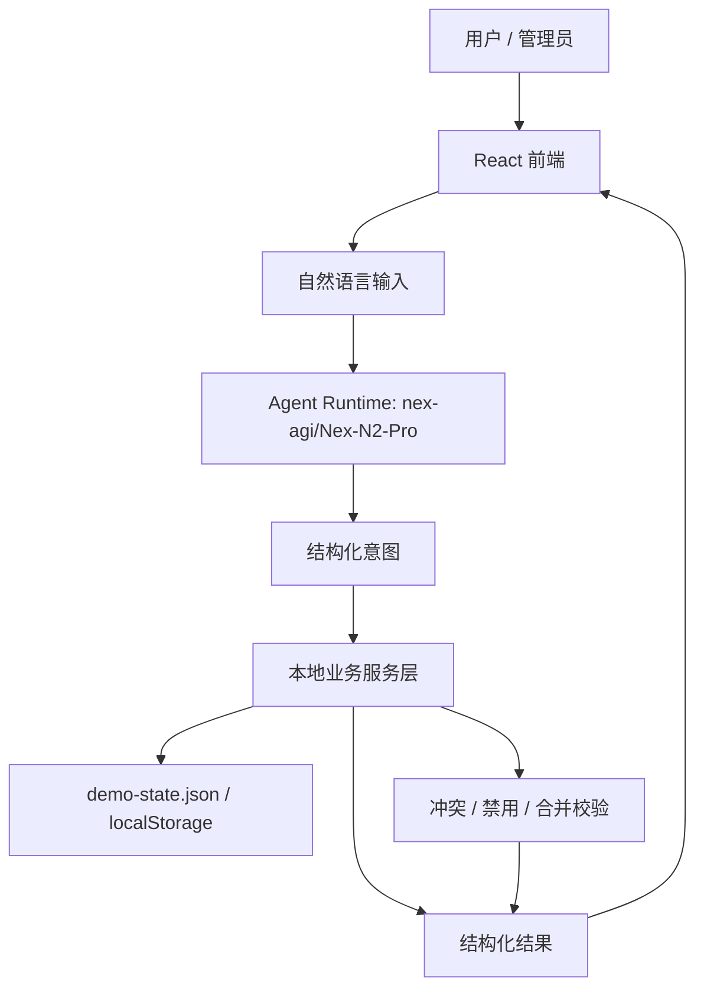
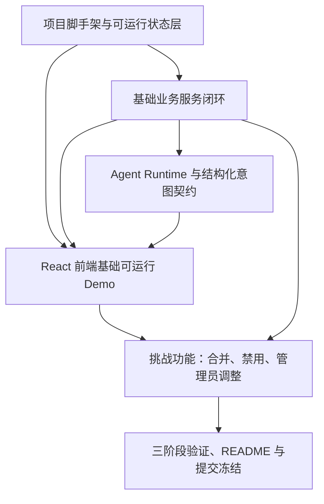

# RFC-0001: 会务系统三阶段可运行交付方案

## 摘要

本 RFC 规划 North Hackathon 第 4 弹 Team4 的会务系统。系统目标是交付一个**真实能跑起来的本地 Web 应用**，而不是静态页面、固定表单或预设答案。

系统采用 Vite + React + TypeScript 构建本地可运行前端，通过 Agent Runtime 接收自然语言，将管理员配置、成员预约、冲突校验、合并会议室、动态禁用和管理员调整转换为结构化意图，并调用本地业务服务真实修改会议室和预约状态。

本 RFC 采用“三阶段可运行交付”策略：

1. **阶段一：本地业务闭环可运行**
   - 可启动 Vite Web 应用；
   - 可真实展示会议室列表和占用状态；
   - 可创建预约、取消预约、校验冲突；
   - 状态真实写入本地 JSON 或 localStorage。

2. **阶段二：Agent 驱动状态变更可运行**
   - 接入 `nex-agi/Nex-N2-Pro`；
   - 用户通过自然语言配置会议室、创建预约、取消预约；
   - Agent 输出结构化意图；
   - 业务服务层执行确定性校验并真实修改状态。

3. **阶段三：挑战功能与提交版可运行**
   - 支持合并会议室；
   - 支持动态禁用；
   - 支持管理员调整；
   - 完成 Demo 场景验证、README 和 `submission` tag 冻结。

后续 RFC 统一遵守“3 个可以运行”的原则：

- 每个 RFC 至少对应一个可启动的 Web Demo；
- 每个 RFC 至少提供 3 个端到端可运行验收场景；
- 每个 RFC 都必须真实修改业务状态，不能只做页面展示或固定返回。

## 动机

赛题要求最终作品必须满足：

- 提供本地可运行的 Web 应用入口；
- 能够通过真实前端操作完成核心业务链路；
- 包含实际运行的 Agent 层，接收自然语言并形成结构化状态或约束；
- Agent 必须调用业务能力完成配置、预约、冲突校验或调整；
- 不能只使用固定表单、关键词判断或预设答案；
- README 必须包含可复现安装与启动步骤；
- 截止版本必须通过 `submission` tag 冻结。

当前仓库处于初始状态，因此本 RFC 的重点不是堆砌功能，而是定义一套可以持续落地的可运行交付方案。每个阶段都必须能启动、能操作、能改状态、能验证。

## 设计

### 概述

系统由以下核心模块组成：

1. **前端 UI 层**
   - 会议室列表；
   - 日期/时段视图；
   - 自然语言输入框；
   - 预约结果；
   - 冲突提示；
   - 管理员配置面板；
   - 动态禁用规则面板；
   - 管理员调整面板。

2. **Agent Runtime 层**
   - 接收自然语言；
   - 使用 `nex-agi/Nex-N2-Pro` 解析用户意图；
   - 输出结构化意图；
   - 不直接写业务状态，只负责意图识别和参数提取。

3. **业务服务层**
   - 会议室配置；
   - 预约创建；
   - 预约取消；
   - 冲突校验；
   - 合并会议室校验；
   - 动态禁用校验；
   - 管理员调整校验。

4. **本地状态层**
   - 使用 JSON 文件或 localStorage 保存 Demo 状态；
   - 优先使用可提交、可复现的 `demo-state.json`；
   - 所有业务操作都必须真实修改状态。

5. **验证与 Demo 层**
   - 提供可运行命令；
   - 提供 Demo 数据重置命令；
   - 提供业务服务测试；
   - 提供端到端手动验证场景。

### 非目标

- 不连接真实日历、支付、企业通讯录或生产会议室系统。
- 不要求公网部署；现场以本地启动为准。
- 不实现完整企业级权限系统；管理员身份通过 Demo 中的“管理员模式”体现。
- 不追求复杂排班优化算法；重点验证自然语言输入、结构化状态转换和真实冲突校验。
- 不将点餐系统纳入本 RFC 范围。
- 不接受只做静态页面、固定答案或不可修改状态的 Demo。

### 关键设计决策

#### 决策 1：以“真实可运行”作为 RFC 的首要目标

本 RFC 不再只描述最终系统，而是要求每个阶段都能真实运行。

每个 RFC 或每个可运行阶段至少需要满足：

- 可以通过命令启动；
- 可以通过前端真实操作；
- 可以真实修改业务状态；
- 可以跑通至少 3 个端到端验收场景；
- 可以在 README 中复现启动和验证流程。

推荐运行命令：

```bash
npm install
npm run dev
npm run seed:demo
npm run test:business
```

其中：

- `npm run dev`：启动本地 Web 应用；
- `npm run seed:demo`：重置 Demo 数据；
- `npm run test:business`：验证业务服务逻辑；
- 手动 Demo：通过浏览器完成真实预约、冲突、取消、配置等操作。

#### 决策 2：采用三阶段可运行交付

为了避免一次性做太大导致 Demo 不可控，系统拆成 3 个可运行阶段。

##### 阶段一：本地业务闭环可运行

目标：不依赖复杂 Agent，先保证核心业务能跑起来。

必须可运行：

- 会议室列表；
- 日期/时段视图；
- 创建预约；
- 取消预约；
- 冲突校验；
- 状态真实写入本地 JSON 或 localStorage。

必须跑通 3 个场景：

1. 查询某日 10:00—11:00 可用小会议室；
2. 创建一条不冲突的预约，并看到状态变化；
3. 创建一条冲突预约，系统明确拒绝。

##### 阶段二：Agent 驱动状态变更可运行

目标：接入真实 Agent Runtime，让自然语言真正驱动业务状态变化。

必须可运行：

- 管理员通过自然语言配置会议室或规则；
- 成员通过自然语言创建预约；
- 成员通过自然语言取消预约；
- Agent 输出结构化意图；
- 业务层校验后真实修改状态。

必须跑通 3 个场景：

1. “新增会议室 504，容量 8，设备有投影和白板。”
2. “下周二 10:00—11:00 想约一间小会议室开项目讨论。”
3. “取消刚才创建的项目讨论预约。”

##### 阶段三：挑战功能与提交版可运行

目标：完成挑战功能，形成最终可展示 Demo。

必须可运行：

- 合并会议室；
- 动态禁用；
- 管理员调整；
- 冲突和禁用校验；
- README；
- `submission` tag。

必须跑通 3 个场景：

1. “本周五 14:00—16:00 要开一场大会议，帮我把会议室一和会议室二合并使用。”
2. “这周三 504 临时维修，全天不能预约。刚才说错了，只停用下午。”
3. “把刚才的预约改到明天下午 15:00—16:00。”

#### 决策 3：Agent 输出结构化意图，业务层负责最终校验

Agent 不直接修改状态，而是输出结构化意图，例如：

- `configure_room`
- `configure_rule`
- `create_booking`
- `cancel_booking`
- `merge_rooms`
- `disable_room_period`
- `admin_update_booking`
- `query_availability`

业务服务层对结构化意图执行确定性校验、冲突检测和状态变更。

这样设计的原因是：

- Agent 负责理解自然语言；
- 业务层负责保证状态正确；
- 避免 LLM 直接写状态导致 Demo 不稳定；
- 便于测试、回放和现场解释。

#### 决策 4：本地 Demo 数据必须覆盖赛题固定规则

系统初始化数据必须包含：

- 活动室：中午作为餐厅，午餐时段不能预约会议；
- 会议室一、会议室二：可分别使用，也可合并成大会议室；
- 503、505、506：三间小会议室；
- 505 每周二全天不可用。

后续自然语言配置和动态禁用规则都在该初始数据基础上叠加。

#### 决策 5：后续 RFC 统一采用“3 个可运行验收场景”

后续 RFC 不再只写功能列表，而必须包含：

1. 可启动命令；
2. 可操作入口；
3. 3 个端到端验收场景；
4. 状态变更说明；
5. 失败兜底方案。

例如：

| RFC | 可运行目标 | 3 个验收场景 |
| --- | --- | --- |
| RFC-0001 | 本地业务闭环 | 查询可用、创建预约、冲突拒绝 |
| RFC-0002 | Agent 驱动状态变更 | 自然语言配置、自然语言预约、自然语言取消 |
| RFC-0003 | 挑战功能与提交版 | 合并会议室、动态禁用、管理员调整 |

## 接口契约

### 自然语言配置 Agent 契约

管理员输入示例：

- “新增会议室 504，容量 8，设备有投影和白板。”
- “把 505 设置为每周二全天不可用。”
- “活动室中午 12:00 到 13:30 作为午餐时段，不能预约。”
- “这周三 504 临时维修，全天不能预约。刚才说错了，只停用下午。”

期望 Agent 输出结构化意图：

```json
{
  "intent": "configure_rule",
  "room_ids": ["room_504"],
  "rule_type": "temporary_unavailable",
  "date": "2026-08-05",
  "start_time": "13:00",
  "end_time": "18:00",
  "reason": "临时维修",
  "operation": "upsert"
}
```

### 创建预约 Agent 契约

成员输入示例：

- “下周二 10:00—11:00 想约一间小会议室开项目讨论。”
- “这周三 504 下午 15:00 到 16:00 预约产品评审。”
- “本周五 14:00—16:00 要开一场大会议，帮我把会议室一和会议室二合并使用。”

期望 Agent 输出结构化意图：

```json
{
  "intent": "create_booking",
  "room_ids": ["room_small_meeting_3"],
  "date": "2026-08-04",
  "start_time": "10:00",
  "end_time": "11:00",
  "title": "项目讨论",
  "organizer": "成员"
}
```

业务服务层返回成功：

```json
{
  "ok": true,
  "booking_id": "booking_001",
  "message": "预约创建成功"
}
```

或返回冲突：

```json
{
  "ok": false,
  "reason": "冲突",
  "conflicts": [
    {
      "booking_id": "booking_000",
      "message": "该时段已被项目周会占用"
    }
  ]
}
```

### 查询可用会议室契约

输入：

```json
{
  "intent": "query_availability",
  "date": "2026-08-04",
  "start_time": "10:00",
  "end_time": "11:00",
  "requirements": ["小会议室"]
}
```

输出：

```json
{
  "available_rooms": [
    {
      "id": "room_503",
      "name": "503",
      "capacity": 6,
      "reason": "满足小会议室要求且无冲突"
    }
  ],
  "unavailable_rooms": [
    {
      "id": "room_505",
      "name": "505",
      "reason": "每周二全天不可用"
    }
  ]
}
```

### 合并会议室契约

输入：

```json
{
  "intent": "merge_rooms",
  "room_ids": ["room_meeting_1", "room_meeting_2"],
  "date": "2026-08-07",
  "start_time": "14:00",
  "end_time": "16:00",
  "operation": "reserve_merged"
}
```

约束：

- 参与合并的房间必须可组合；
- 所有参与房间在目标时段均可用；
- 合并预约创建后，任一参与房间在目标时段不可再被单独预约；
- 取消合并预约时，应同时释放所有参与房间。

### 动态禁用契约

输入：

```json
{
  "intent": "disable_room_period",
  "room_ids": ["room_504"],
  "date": "2026-08-05",
  "start_time": "13:00",
  "end_time": "18:00",
  "reason": "临时维修",
  "operation": "upsert"
}
```

约束：

- 同一房间同一日期同一类型规则可更新；
- 若用户修正时间范围，应更新同一条规则而不是新增重复规则；
- 动态禁用优先级高于普通预约；
- 若已有预约落在禁用时段，管理员调整时必须给出提示。

### 管理员调整契约

输入示例：

```json
{
  "intent": "admin_update_booking",
  "booking_id": "booking_001",
  "operation": "move",
  "date": "2026-08-05",
  "start_time": "15:00",
  "end_time": "16:00"
}
```

约束：

- 管理员可修改已有预约的房间或时间；
- 修改后仍需执行冲突校验和动态禁用校验；
- 管理员可取消预约；
- 管理员强制调整应记录操作原因，便于 Demo 解释。

## 架构图



## 权衡取舍

### 考虑过的替代方案

#### 方案 A：只做静态页面或固定表单

优点：开发快，页面容易做出来。

缺点：不满足赛题“Agent 真正参与业务过程”的硬性要求，也无法真实修改业务状态。

结论：不采用。

#### 方案 B：只做最终大版本，不拆可运行阶段

优点：设计上更完整。

缺点：风险高，容易出现最后 Demo 跑不起来的问题。

结论：不采用。改为三阶段可运行交付。

#### 方案 C：Next.js 全栈

优点：可以统一管理前端和 API。

缺点：配置更重，现场启动和依赖安装的不确定性更高。

结论：不采用。优先选择 Vite + React + TypeScript。

#### 方案 D：直接连接真实日历或外部系统

优点：更接近生产系统。

缺点：增加鉴权、网络、数据权限和不可控因素。赛题明确不要求连接真实生产系统。

结论：不采用。使用本地 Demo 数据和本地持久化。

### 缺点

- 本地持久化不如真实后端健壮，多人真实协作能力有限。
- Agent 意图解析依赖 LLM 输出稳定性，需要 schema 校验和兜底提示。
- 管理员权限采用 Demo 简化模型，不适合生产环境。
- 为追求稳定，未纳入平面图视图等展示型挑战功能。

## 实现计划

### 阶段划分

1. **阶段一：本地业务闭环可运行**
   - 完成初始化数据；
   - 完成会议室列表；
   - 完成日期/时段视图；
   - 完成创建预约、取消预约、冲突校验；
   - 状态真实写入本地 JSON 或 localStorage。

2. **阶段二：Agent 驱动状态变更可运行**
   - 接入 `nex-agi/Nex-N2-Pro`；
   - 定义并校验结构化意图；
   - 支持自然语言配置、预约、取消；
   - 确保 Agent 输出后业务层真实改状态。

3. **阶段三：挑战功能与提交版可运行**
   - 完成合并会议室；
   - 完成动态禁用；
   - 完成管理员调整；
   - 跑通 Demo 场景；
   - 补齐 README；
   - 冻结 `submission` tag。

### 子任务分解

#### 依赖关系图



#### 子任务列表

| ID | 标题 | 依赖 | Ref |
| --- | --- | --- | --- |
| T1 | 项目脚手架、初始化数据与本地状态层 | 无 |  |
| T2 | 基础业务服务闭环：查询、预约、取消、冲突校验 | T1 |  |
| T3 | React 前端基础可运行 Demo | T1, T2 |  |
| T4 | Agent Runtime 接入与结构化意图校验 | T2 |  |
| T5 | 挑战功能：合并会议室、动态禁用、管理员调整 | T2, T3 |  |
| T6 | 三阶段验证、README 与提交冻结 | T5 |  |

#### 子任务定义

##### T1：项目脚手架、初始化数据与本地状态层

范围：

- 初始化 Vite + React + TypeScript；
- 定义会议室、预约、规则、动态禁用、管理员操作记录的数据结构；
- 初始化活动室、会议室一/二、503、505、506 及固定规则；
- 提供 `demo-state.json` 或 localStorage 持久化接口；
- 提供 `seed:demo` 数据重置能力。

验收标准：

- `npm install` 可成功；
- `npm run dev` 可启动基础页面或业务页面；
- `npm run seed:demo` 可重置 Demo 数据；
- 505 每周二全天不可用；
- 活动室午餐时段不可预约。

##### T2：基础业务服务闭环：查询、预约、取消、冲突校验

范围：

- 查询可用会议室；
- 创建预约；
- 取消预约；
- 重叠时段冲突检测；
- 动态禁用和固定规则校验；
- 返回结构化成功/失败结果。

验收标准：

- 同一会议室重叠预约被拒绝；
- 取消预约后原时段可再次预约；
- 活动室午餐时段预约被拒绝；
- 505 周二预约被拒绝；
- 业务服务可独立通过 `npm run test:business` 验证。

##### T3：React 前端基础可运行 Demo

范围：

- 会议室列表展示名称、位置、容量、设备；
- 日期/时段选择视图展示占用状态；
- 创建预约入口；
- 取消预约入口；
- 冲突提示；
- 预约成功反馈；
- 管理员模式切换。

验收标准：

- 用户可通过真实前端操作完成查询、预约、取消；
- UI 能展示业务层校验结果；
- 前端操作后状态真实变化；
- 本地启动命令简单可复现。

##### T4：Agent Runtime 接入与结构化意图校验

范围：

- 在本地 Runtime 中接入 `nex-agi/Nex-N2-Pro`；
- 定义配置、预约、取消、查询、合并、禁用、管理员调整等意图 schema；
- 对 LLM 输出进行 JSON schema 或 zod 校验；
- 对无法解析的输入返回澄清问题或错误提示；
- 前端通过 Agent 调用业务服务。

验收标准：

- 前端输入自然语言后，Agent 能输出结构化意图；
- 业务层只接收校验后的结构化意图；
- North Gate 请求历史能证明使用 N2 模型；
- 对歧义输入有明确兜底反馈；
- Agent 输出后业务状态真实变化。

##### T5：挑战功能：合并会议室、动态禁用、管理员调整

范围：

- 会议室一和会议室二可合并预约；
- 合并预约期间两个房间不可分别预约；
- 支持临时不可预约时段；
- 支持同一条动态禁用规则更新；
- 管理员可修改、取消或强制调整预约；
- 对冲突和禁用给出清晰提示。

验收标准：

- “本周五 14:00—16:00 要开一场大会议，帮我把会议室一和会议室二合并使用”可成功创建合并预约；
- 合并预约创建后，任一房间同一时段单独预约被拒绝；
- “这周三 504 临时维修，全天不能预约。刚才说错了，只停用下午”只更新同一条规则；
- 管理员调整会重新执行冲突和禁用校验。

##### T6：三阶段验证、README 与提交冻结

范围：

- 跑通阶段一、阶段二、阶段三的 3 个可运行验收场景；
- 编写 README：Topic、功能、启动步骤、Runtime、Demo 数据、成员贡献、已知限制；
- 执行基础验证命令；
- 冻结 `submission` tag。

验收标准：

- `npm install` 成功；
- `npm run dev` 可启动；
- `npm run seed:demo` 可重置数据；
- `npm run test:business` 通过；
- 浏览器中可完成真实业务闭环；
- README 与实现一致；
- `git status` clean；
- `submission` tag 已推送。

## 测试方案

### 单元测试

- 会议室初始化数据测试；
- 固定规则测试：505 周二不可用、活动室午餐不可预约；
- 预约冲突测试；
- 取消预约释放时段测试；
- 合并会议室校验测试；
- 动态禁用规则 upsert 测试；
- 管理员调整冲突/禁用校验测试；
- Agent 意图 schema 校验测试。

### 集成测试

- 管理员自然语言配置后，状态进入系统并影响预约；
- 成员自然语言预约后，业务层完成冲突校验并写入状态；
- 前端通过 Agent 调用业务服务完成预约、取消、查询；
- 合并会议室预约阻止单房间重复预约；
- 动态禁用修正只更新同一条规则。

### 三阶段可运行验收

#### 阶段一：本地业务闭环可运行

必须跑通：

1. 查询某日 10:00—11:00 可用小会议室；
2. 创建一条不冲突的预约，并看到状态变化；
3. 创建一条冲突预约，系统明确拒绝。

#### 阶段二：Agent 驱动状态变更可运行

必须跑通：

1. “新增会议室 504，容量 8，设备有投影和白板。”
2. “下周二 10:00—11:00 想约一间小会议室开项目讨论。”
3. “取消刚才创建的项目讨论预约。”

#### 阶段三：挑战功能与提交版可运行

必须跑通：

1. “本周五 14:00—16:00 要开一场大会议，帮我把会议室一和会议室二合并使用。”
2. “这周三 504 临时维修，全天不能预约。刚才说错了，只停用下午。”
3. “把刚才的预约改到明天下午 15:00—16:00。”

### 启动验证

- `npm install`
- `npm run dev`
- `npm run seed:demo`
- `npm run test:business`
- 浏览器访问 README 指定地址；
- 通过前端真实操作完成基础闭环；
- 检查 North Gate 请求历史中模型为 `nex-agi/Nex-N2-Pro`。

## 未解决的问题

无。当前 RFC 的范围、技术栈、挑战功能和可运行交付策略已经通过需求澄清确认。

## 参考资料

- `docs/hackathon-spec.md`
- 飞书赛题说明：https://sxddhcrtbqu.feishu.cn/wiki/UP0Jw9TuAiOBIykjIsOc1VznnkM?from=from_copylink
- North Coder RFC 开发文档：https://coder.xiaobei.top/docs/rfc-mode
- NAC 云端 Agent Runtime 文档：https://nac.xiaobei.top/docs/tools/nac-cli
