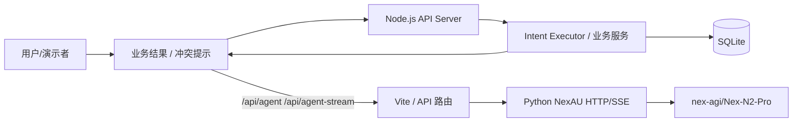
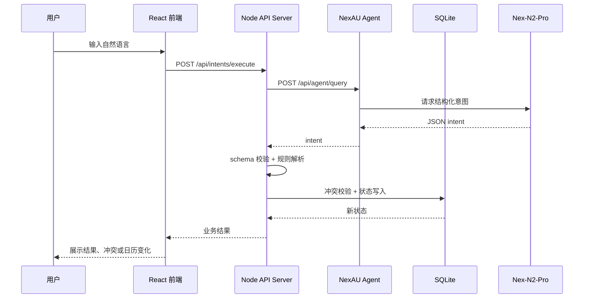
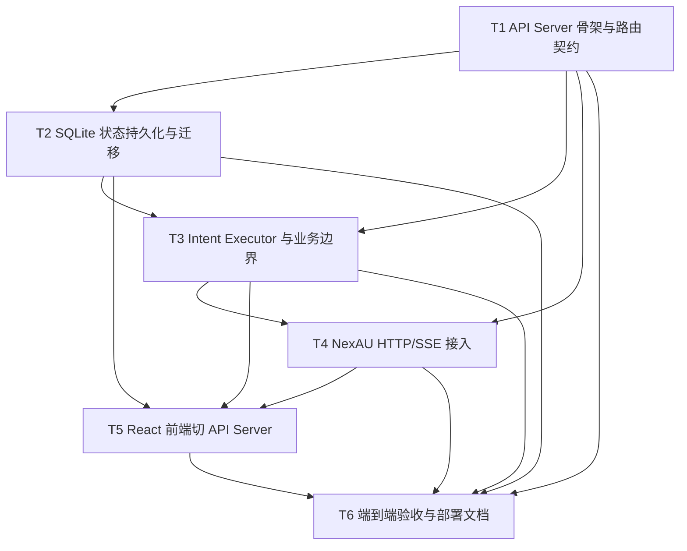

# RFC-0002: 会务系统 Agent 驱动架构与可部署 Demo 设计

## 摘要

本 RFC 定义会务系统 Demo 的可运行架构：前端继续保留 Vite + React + TypeScript 作为 Web 入口，业务层升级为独立的 Node.js + TypeScript API Server，状态存储从浏览器本地状态迁移到 SQLite，Agent Runtime 采用 Python NexAU 的 HTTP/SSE Transport，并通过 Vite dev proxy 或生产环境 API 路由接入 `nex-agi/Nex-N2-Pro`。

核心目标是让 Demo 能通过真实前端操作完成自然语言配置、会议室查询、预约创建、冲突校验、取消预约、动态禁用、合并会议室等端到端场景，并确保 Agent 只负责把自然语言转换为结构化意图，最终状态写入必须由业务服务校验后完成。

## 动机

RFC-0001 已经让会务系统具备基础可运行 Demo 形态，但当前实现仍存在三个限制：

1. 状态主要依赖前端/本地 JSON 服务，缺少统一持久化层，难以在 API Server、脚本和部署环境中共享同一份业务状态。
2. NexAU Agent 目前只是配置入口，还没有稳定接入 HTTP/SSE Runtime，也没有明确的“Agent 解析意图 -> 业务服务校验 -> SQLite 写状态”的边界。
3. 当前前端虽然能展示业务结果，但还不是完整 API Server 驱动的可部署架构，不利于现场演示、脚本验收和后续多人并行开发。

本 RFC 的目标是把 Demo 收敛成稳定、可启动、可验收、可并行实现的架构。

## 设计

### 概述

系统拆为四层：



职责边界：

- **React 前端**：展示会议室、日历/时段、预约列表、规则列表、业务结果；提供自然语言输入框；不再直接拥有最终业务状态。
- **Node.js API Server**：提供业务 API、SQLite 访问、请求校验、Intent Executor、种子数据脚本、端到端验收脚本入口。
- **SQLite**：作为本地和部署环境共享的持久化存储，保存会议室、合并状态、预约、规则、动态禁用、管理员操作和业务结果。
- **NexAU HTTP/SSE**：只接收自然语言请求并输出结构化 JSON 意图；不直接读写业务状态。
- **业务服务/Intent Executor**：负责 schema 校验、房间 ID 解析、冲突检测、规则计算、状态写入和结果返回。

### 关键设计决策

#### 决策 1：NexAU 接入采用 HTTP/SSE + API 路由

用户已确认采用 HTTP/SSE + Vite proxy。设计如下：

- 本地开发：`vite.config.ts` 将 `/api/agent` 代理到 NexAU HTTP `/query`，将 `/api/agent-stream` 代理到 NexAU HTTP `/stream`。
- API Server 模式：生产/部署环境中由 Node API Server 提供统一的 `/api/agent/query` 和 `/api/agent/stream`，内部转发到 NexAU。
- 前端只调用业务 API 或统一 Agent API，不关心 NexAU 实际地址。

NexAU 文档确认支持：

- `uv run nexau serve http --config agent.yaml --port 8000`
- `/query` 同步查询
- `/stream` SSE 流式查询
- `/health` 健康检查

#### 决策 2：业务服务必须是完整 API Server

当前业务逻辑不能只停留在前端调用本地 TS 函数。需要新增或升级 API Server，提供稳定 HTTP 契约：

- `/api/health`
- `/api/rooms`
- `/api/availability`
- `/api/bookings`
- `/api/rules`
- `/api/intents`
- `/api/seed`
- `/api/agent/query`
- `/api/agent/stream`

这样可以同时支持前端、CLI 脚本、验收脚本和未来部署环境。

#### 决策 3：SQLite 是唯一业务状态源

SQLite 用于保存所有真实业务状态：

- 会议室配置
- 合并会议室配置
- 预约
- 不可预约规则
- 动态禁用
- 管理员操作
- 业务执行结果
- Agent 意图记录

前端不再以 localStorage 或内存状态作为最终状态。前端可以缓存展示状态，但刷新后必须能从 API Server + SQLite 恢复。

#### 决策 4：Agent 不直接写状态

Agent 输出必须符合 `StructuredIntent` JSON schema。业务服务负责：

1. 校验 JSON schema；
2. 将自然语言中的房间别名映射到标准 room ID；
3. 解析日期和时段；
4. 执行冲突校验；
5. 校验权限边界；
6. 写入 SQLite；
7. 返回可解释业务结果。

该边界避免 Agent 幻觉直接污染业务状态。

#### 决策 5：暂不引入 NexAU rs 版本

用户确认当前不需要引入 NexAU Rust/rs 版本。原因是本 Demo 的时间目标是稳定可运行、可部署、可验收；Python NexAU 文档和 HTTP/SSE Transport 更明确，和当前 TypeScript 业务服务通过 HTTP 集成也最简单。

#### 决策 6：凭据只通过环境变量注入

必须使用：

```bash
LLM_MODEL=nex-agi/Nex-N2-Pro
LLM_BASE_URL=<不提交>
LLM_API_KEY=<不提交>
```

仓库只提交 `.env.example`，不提交 `.env`，不提交任何 API key、服务器密码或部署凭据。

### 接口契约

#### Agent 意图契约

NexAU 必须输出如下结构：

```json
{
  "action": "queryAvailability",
  "actorRole": "member",
  "entities": {
    "roomNames": ["503", "505", "506"],
    "date": "2026-08-04",
    "range": { "start": "10:00", "end": "11:00" }
  },
  "constraints": {}
}
```

允许 action 包括：

- `listRooms`
- `queryAvailability`
- `createBooking`
- `cancelBooking`
- `configureRoom`
- `configureRule`
- `updateRule`
- `deleteRule`
- `dynamicDisableRoom`
- `dynamicEnableRoom`
- `mergeRooms`
- `unmergeRooms`
- `adjustBooking`
- `unknown`

业务服务必须拒绝缺少必要字段的意图，并返回清晰错误。

#### API Server 契约

| 方法 | 路径 | 说明 |
| --- | --- | --- |
| GET | `/api/health` | 返回 API、SQLite、NexAU 可达性 |
| GET | `/api/rooms` | 查询会议室和合并状态 |
| GET | `/api/availability?date=&start=&end=&roomIds=` | 查询可用会议室 |
| GET | `/api/bookings?date=&roomId=` | 查询预约 |
| POST | `/api/bookings` | 创建预约 |
| DELETE | `/api/bookings/:id` | 取消预约 |
| GET | `/api/rules` | 查询规则 |
| POST | `/api/rules` | 创建规则 |
| PATCH | `/api/rules/:id` | 更新规则 |
| DELETE | `/api/rules/:id` | 删除规则 |
| POST | `/api/intents/execute` | 执行结构化意图并写 SQLite |
| POST | `/api/agent/query` | 调用 NexAU 同步意图解析 |
| POST | `/api/agent/stream` | 调用 NexAU SSE 意图解析 |
| POST | `/api/seed` | 初始化/重置 Demo 数据 |

#### SQLite 表设计

至少包含以下表：

- `rooms`
- `merged_rooms`
- `bookings`
- `unavailability_rules`
- `dynamic_disables`
- `admin_operations`
- `business_results`
- `agent_intents`

字段设计原则：

- 所有写操作记录 `created_at`、`updated_at`、`actor`、`source`。
- 预约和规则必须支持审计追踪。
- 业务结果表用于前端展示 Agent 执行后的解释、冲突原因和状态变化。

### 架构图



## 权衡取舍

### 考虑过的替代方案

#### 方案 A：只用前端 + 本地 JSON 状态

优点：实现最快，依赖最少。

缺点：

- 不符合“真实业务状态”和可部署 Demo 的方向；
- 难以支持脚本验收、部署环境和多人协作；
- 状态容易随浏览器刷新丢失或分叉。

结论：拒绝。

#### 方案 B：Agent 直接调用工具写状态

优点：Agent 参与感更强。

缺点：

- 状态写入边界不清晰；
- Agent 幻觉或格式错误可能直接污染业务数据；
- 冲突校验和审计更难统一。

结论：拒绝。采用 Agent 只解析意图，业务服务最终校验和写入。

#### 方案 C：引入 NexAU rs 版本

优点：如果团队更熟悉 Rust，理论上可探索 Rust Runtime。

缺点：

- 当前项目主体是 TypeScript + React + Node；
- Python NexAU 的 HTTP/SSE 文档和 CLI 已可验证；
- Hackathon Demo 优先稳定可跑，不应引入未验证运行时。

结论：暂不采用。

### 缺点

- 架构比纯前端 Demo 更复杂，需要多人并行实现和集成测试。
- SQLite 迁移需要谨慎处理已有 JSON/localStorage 数据。
- HTTP/SSE Transport 在 NexAU 文档中标为 experimental，需要保留降级路径和启动说明。

## 实现计划

### 阶段划分

1. 先完成 API Server 和 SQLite 持久化，保证业务状态有统一来源。
2. 再接入 NexAU HTTP/SSE 和 Intent Executor，保证自然语言能转换为结构化意图。
3. 最后切前端到 API Server，并补齐验收脚本和部署文档。

### 子任务分解

#### 依赖关系图



#### 子任务列表

| ID | 标题 | 依赖 | Ref |
| --- | --- | --- | --- |
| T1 | API Server 骨架与路由契约 | 无 |  |
| T2 | SQLite 状态持久化与迁移 | T1 |  |
| T3 | Intent Executor 与业务边界 | T1, T2 |  |
| T4 | NexAU HTTP/SSE 接入 | T1, T3 |  |
| T5 | React 前端切 API Server | T2, T3, T4 |  |
| T6 | 端到端验收与部署文档 | T1, T2, T3, T4, T5 |  |

#### 子任务定义

##### T1：API Server 骨架与路由契约

范围：

- 新增 Node.js + TypeScript API Server。
- 定义 `/api/health`、`/api/rooms`、`/api/availability`、`/api/bookings`、`/api/rules`、`/api/intents/execute` 等基础路由。
- 建立统一请求/响应格式和错误格式。

验收标准：

- `npm run dev:api` 可启动 API Server。
- `/api/health` 返回 API 状态。
- 路由契约与 RFC 一致。
- 不直接写死 Demo 答案。

##### T2：SQLite 状态持久化与迁移

范围：

- 引入 SQLite 作为状态源。
- 建立会议室、预约、规则、动态禁用、管理员操作、业务结果、Agent 意图表。
- 提供 seed 脚本，初始化赛题要求的会议室和固定规则。

验收标准：

- `npm run seed:demo` 可初始化 SQLite。
- 505 周二不可用、活动室午餐规则、会议室一二可合并规则真实进入状态。
- 刷新或重启 API Server 后状态仍可恢复。

##### T3：Intent Executor 与业务边界

范围：

- 实现结构化意图 schema 校验。
- 实现房间别名、日期、时段解析。
- 实现冲突检测、规则计算、动态禁用、合并/拆分、预约创建/取消。
- 保证 Agent 不直接写状态，业务服务最终写入 SQLite。

验收标准：

- 同一会议室重叠时段不能重复预约。
- 活动室午餐时段不能创建会议预约。
- 会议室一和会议室二合并期间不能分别预约。
- 动态禁用修改只更新对应规则并影响可用结果。

##### T4：NexAU HTTP/SSE 接入

范围：

- 配置 NexAU HTTP/SSE 启动脚本。
- 前端 dev proxy 或 API Server 代理到 `/query` 和 `/stream`。
- 对 NexAU 输出做 JSON 解析、schema 校验和错误兜底。

验收标准：

- `uv run nexau serve http --config runtime/meeting-agent/meeting_agent.yaml --port 8000` 可启动。
- `/api/agent/query` 能返回结构化 JSON 意图。
- `/api/agent/stream` 能消费 SSE 并提取最终意图。
- 凭据只从环境变量读取，不写入仓库。

##### T5：React 前端切 API Server

范围：

- 前端改为调用 API Server，不再直接改本地 JSON/localStorage。
- 保留自然语言输入、会议室列表、日历/时段、预约列表、规则列表、业务结果展示。
- 展示 Agent 意图解析结果、业务结果、冲突原因和状态变化。

验收标准：

- 前端可通过自然语言完成查询、预约、取消、禁用、合并。
- 前端展示的状态来自 API Server/SQLite。
- 页面刷新后仍能恢复业务状态。
- 不出现固定答案或静态演示。

##### T6：端到端验收与部署文档

范围：

- 编写 3 个以上可运行验收场景。
- 补齐 README 启动步骤、环境变量说明、NexAU 启动步骤、SQLite 初始化步骤。
- 提供脚本或命令验证核心链路。

验收标准：

- 至少 3 个端到端场景真实跑通并修改 SQLite 状态。
- README 不包含 API key、服务器密码或其他敏感信息。
- 现场 Demo 可从冻结版本启动。

### 影响范围

主要影响文件/目录：

- `src/services/meetingBusiness.ts`：迁移为 API Server/SQLite 驱动的业务服务。
- `src/services/agentClient.ts`：从本地解析升级为 NexAU HTTP/SSE 客户端。
- `src/App.tsx`、`src/main.tsx`：前端切 API Server。
- `vite.config.ts`：保留 dev proxy，并增加 API Server 代理策略。
- `runtime/meeting-agent/meeting_agent.yaml`：保持 NexAU 配置，补充环境变量说明。
- `scripts/seed-demo.ts`、`scripts/test-business.ts`：新增种子数据和验收脚本。
- `docs/rfcs/`：新增本 RFC 和索引。
- `README.md`：更新启动、验收和部署说明。

## 测试方案

1. **类型检查**：`npm run typecheck` 必须通过。
2. **前端构建**：`npm run build` 必须通过。
3. **API Server 启动**：`npm run dev:api` 必须可启动并响应 `/api/health`。
4. **NexAU 启动**：`uv run nexau serve http --config runtime/meeting-agent/meeting_agent.yaml --port 8000` 必须可启动并响应 `/health`。
5. **SQLite 种子数据**：`npm run seed:demo` 必须可重复执行并生成固定规则。
6. **业务验收**：至少覆盖以下 3 个端到端场景：
   - 下周二 10:00—11:00 查询小会议室，结果中不包含 505。
   - 明天中午预约活动室，被午餐规则阻止。
   - 本周五 14:00—16:00 合并会议室一和会议室二，合并期间两个源房间不能再分别预约。
   - 额外覆盖：506 临时维修，先全天禁用，再改为只停用下午。

## 未解决的问题

无。

## 参考资料

- `docs/hackathon-spec.md`
- `runtime/nexau/docs/advanced-guides/transports.md`
- `runtime/meeting-agent/meeting_agent.yaml`
- RFC-0001: 会务系统 Demo 可运行基线
